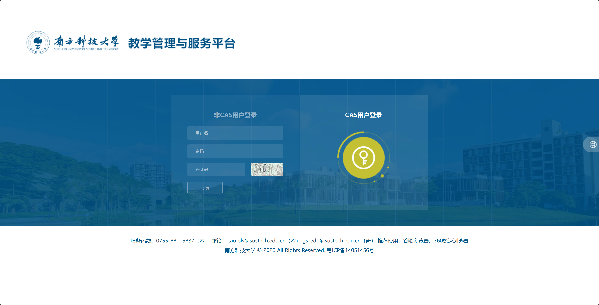
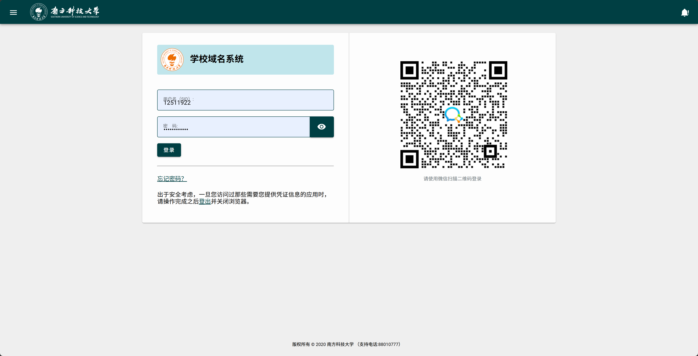
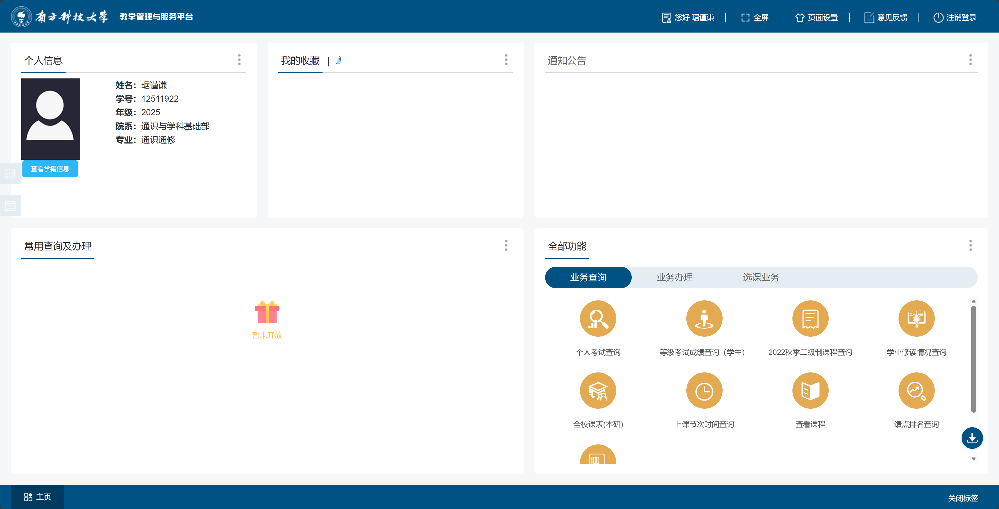
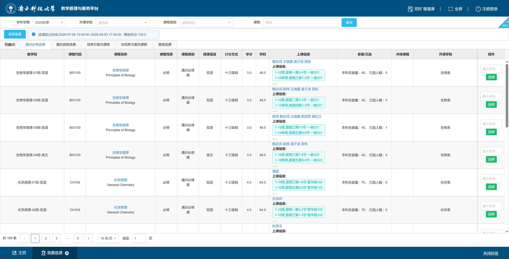

# 项目背景
南科大许多系统做的很烂，信息获取极其缓慢，网站做的及其难用。

--- 

# 项目目标
逆向南科大的本科教务系统（先完成选课的部分），并封装出获取选课数据的接口。

## 登录细节
- 人工获取选课信息流程：首先打开 https://tis.sustech.edu.cn/authentication/main ，此时由于没有登录信息，会定向到https://tis.sustech.edu.cn/session/invalid：

此时点击CAS用户登录得到url变为：https://cas.sustech.edu.cn/cas/login?service=https%3A%2F%2Ftis.sustech.edu.cn%2Fcas 这个service后面一串东西暂时不知道含义，需要分析。得到：

输入用户名密码后点击如图的登录。才可进入：https://tis.sustech.edu.cn/authentication/main
需要注意的是，这个登录每次过一段时间就会自动退出登录（这一块原理也最好搞清楚）。
## 选课相关信息
登录和得到如图：

点击选课业务（tab），再点击"我要选课"按钮即可进入选课页面，页面如下：

有多个板块和分页。
